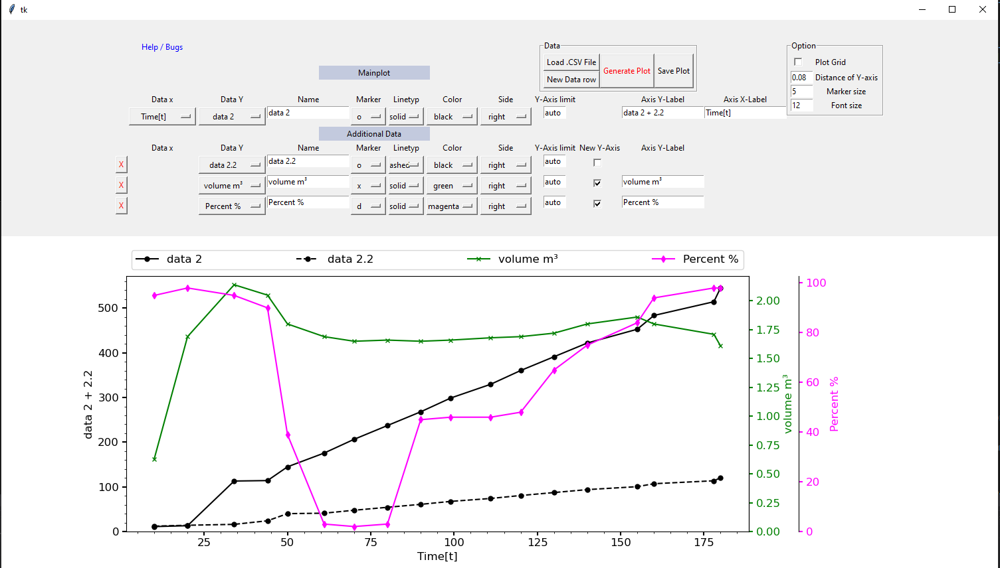
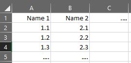

# Simple-Pyplot-GUI
A GUI for creating simple scientific dataplots based on Matplotlib and tkinter for Python. Multiple axis labeling supported.

## EXE

## Example

## Raw Data
The must be a .CSV format (from e.g. Excel). Fist Cell needs to be a "name", followd by the data. As Example:

## Known Issue
"Not all the Axis are visible in the preview" - Try saving the plot as a .jpg, more reliable.
